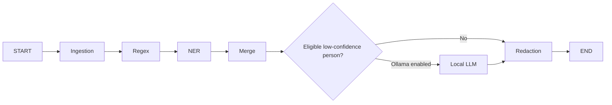

# Architecture

## Boundaries

Business logic lives in framework-neutral functions under `src/docx_de_identifier/agents/`. `graph.py` adapts those functions to LangGraph. A future CrewAI adapter can call the same functions without changing detection or redaction behavior.

The retained document scope is ordinary body paragraphs and nested tables, including safely represented body content controls and fields. The ingestion agent removes all excluded surfaces before downstream agents receive text.

## Graph

## Agents

### Ingestion

Validates the DOCX package, removes excluded surfaces and relationships, sanitizes core metadata, extracts retained paragraphs, and records mappings from flattened offsets to WordprocessingML text nodes. Hyperlink ranges are marked immutable.

### Regex Detection

Produces candidates for message-header names, aliases/tags, emails, US phone numbers, absolute timestamps, relative timestamps, durations, and whole reaction lines. It does not mutate the document.

### NER Detection

Loads a configured local spaCy model and adds `PERSON` candidates outside hyperlink ranges. The callable is injectable for deterministic tests.

### Merge and Resolver

Deduplicates overlaps, gives whole reaction-line removal and domain regex detections priority, normalizes name forms such as `Doe, Jane` and `Jane Doe`, and assigns stable placeholders in document order.

### Local LLM Disambiguation

Optionally asks loopback Ollama about only low-confidence person candidates. A candidate is exempted from redaction only after a schema-valid rejection at or above the configured threshold. Errors and uncertainty retain redaction.

### Redaction

Applies resolved spans right-to-left across mapped XML text nodes, clears reaction paragraphs, preserves unaffected run formatting and body hyperlinks, writes the document, and creates hashed audit events.

## Shared State

`PipelineState` contains input/output paths and progressively adds:

- `document_context`: in-memory DOCX and XML bindings
- `paragraphs`: retained `ParagraphRecord` values
- `candidates`: pre-merge `EntityCandidate` values
- `resolved_entities`: accepted entities with canonical IDs and placeholders
- `removed_content`: excluded package categories
- `audit_events`: PII-free decision records

Nodes return partial state updates. No checkpointer is used because each CLI invocation is a single automatic run.

## Output Safety

The CLI writes to temporary files in the destination directory. It validates that the DOCX reopens, forbidden parts and exact XML tags are absent, and only then atomically replaces the final document and JSON audit paths.
