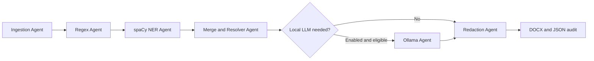

# docx-de-identifier

An offline Python CLI that de-identifies Word documents through a LangGraph workflow of specialized agents. A run is automatic: one `.docx` goes in, one sanitized `.docx` and a PII-free JSON audit come out.

## Safety Contract

The pipeline detects names, emails, common US phone numbers, message-header aliases/tags, reaction lines, absolute timestamps, relative timestamps, and durations. It preserves ordinary body and nested-table prose plus body hyperlink text and targets.

The output intentionally removes headers, footers, comments, footnotes/endnotes, text boxes, all tracked-change markup and revision content, images, charts, drawings, SmartArt, and embedded objects. Use a copy of the source document because those removals are irreversible.

Runtime execution is offline. spaCy models must already be installed locally. Optional Ollama use is limited to `localhost` or a loopback IP; hosted model endpoints are rejected.

## Setup

```powershell
py -m venv .venv
.\.venv\Scripts\Activate.ps1
python -m pip install -e ".[dev]"
python -m spacy download en_core_web_sm
```

`en_core_web_trf` can be installed and selected in `config.yaml` when greater local accuracy is worth the larger model and slower runtime. Model installation requires connectivity once; document processing does not.

## Usage

```powershell
docx-de-identifier input.docx
docx-de-identifier input.docx --output output.docx --config config.yaml
```

The default outputs are `input.deidentified.docx` and `input.deidentified.audit.json`. Existing outputs are protected unless `--overwrite` is supplied.

## Configuration

The checked-in `config.yaml` contains conservative defaults:

- aliases and both timestamp classes are redacted
- `en_core_web_sm` is the local spaCy model
- local LLM disambiguation is disabled
- uncertain candidates remain redacted
- Ollama, when enabled, is restricted to `http://127.0.0.1:11434`

The JSON audit includes file hashes, removed-content categories, detector source, confidence, location, canonical ID, action, placeholder, and a salted value hash. It never includes the raw detected value.

## Agentic Architecture



Each node has one responsibility and communicates through typed shared state. Detection agents propose candidates without editing the document. The resolver owns overlap priority, canonical identities, and stable placeholders. Redaction receives only final decisions.

This is multi-agent orchestration without multiple chat personas: most agents are deterministic specialists, while the optional LLM handles only ambiguous classification. Keeping their functions independent of LangGraph makes the behavior unit-testable and allows a future CrewAI orchestration layer to reuse them.

See `ARCHITECTURE.md` for node contracts and state details.

## Development

```powershell
ruff check .
ruff format --check .
mypy src
pytest --cov=docx_de_identifier --cov-report=term-missing
python -m build
```

Tests generate synthetic DOCX files at runtime. Real `.docx` files are ignored by Git and must not be committed.

## Limitations

- Hyperlink display text is intentionally preserved even when it resembles a name.
- The built-in phone patterns target common US formats.
- De-identification is conservative but cannot guarantee that every possible identifier in arbitrary prose is detected.
- Visual content is removed rather than inspected because v1 has no OCR pipeline.